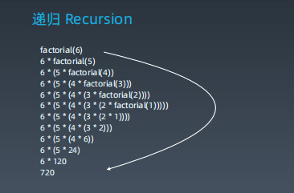
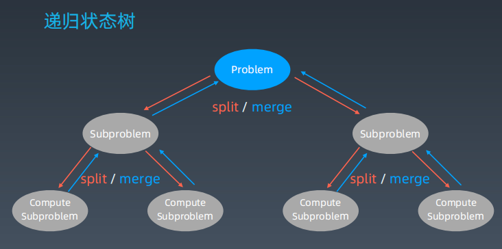

# 学习笔记
## 递归
递归终结条件
处理当前层
下一层

递归-循环，通过函数体来进行的循环。

思维要点：
1，不要人肉递归
2，找到最近最简的问题，重复子问题
3，数学归纳法思维

## 分治、回溯
特殊的递归

#### 回溯
回溯法采用试错的思想，它尝试分步的去解决一个问题。在分步解决问题的过程中，当它通过尝试发现现有的分步答案不能得到有效的正确解答时，它将取消上一步甚至几步的计算，在通过其它的可能的分步解答再次尝试寻找问题的答案。  
回溯法通常用最简单的递归方法来实现，在反复重复上述步骤后可能出现两种情况：
* 找到一个可能存在的正确的答案
* 在尝试了所有可能的分步方法后宣告该问题没有答案。
在最坏的情况下，回溯法会导致一次复杂度为指数时间的计算。

题目：

70. 爬楼梯
22. 括号生成 
50. pow(x,n)
78. 子集
169. 多数元素
17. 电话号码的字母组合
98. 验证二叉搜索树
226. 翻转二叉树
104. 二叉树的最大深度
111. 二叉树的最小深度
297. 二叉树的序列化与反序列化
236. 二叉树的最近公共祖先
47.  全排列2
46.  全排列
77.  组合
105. 从前序和中序遍历序列构造二叉树 
51. n皇后

