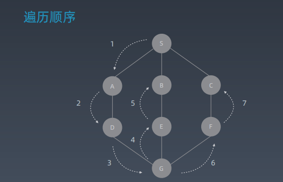
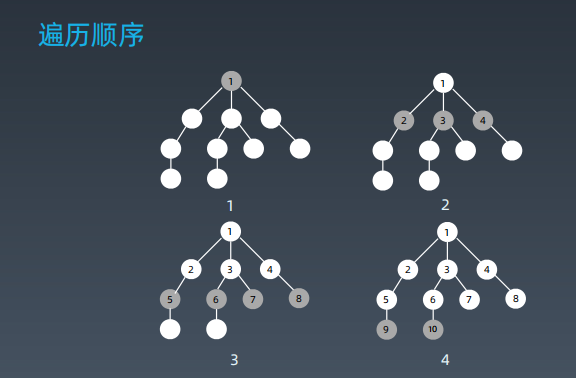

# 学习笔记

## 深度优先搜索、广度优先搜索


#### 搜索-遍历

每个节点都要访问1次
每个节点仅仅要访问1次
对节点的访问顺序不限  
    DFS  
    BFS  

##### DFS




##### BFS




## 贪心算法 Greedy

贪心算法是一种在每一步选择中都采取在当前状态下最好或最优的选择，从而希望导致结果是全局最好或最优的算法。

贪心算法与动态规划的不同在于 它对每个子问题的解决方案都作出选择，不能回退。
动态规划则会保存以前的运算结果，并根据以前的结果对当前进行选择，有回退功能。

贪心算法可以解决一些最优化问题，如：求图中的最小生成树，求哈夫曼编码等。然后对于工程和生活中的问题，贪心算法一般不能得到我们所要的答案。

一旦一个问题可以通过贪心算法来解决，那么贪心算法一般是解决这个问题的最好办法。由于贪心算法的高效性以及其所求的答案比较接近最优结果，贪心法也可以用作辅助算法或者直接解决一些要求结果不是特别精确的问题。

###### 贪心算法适用场景

问题能够分解成子问题来解决，子问题的最优解能递推到最终问题的最优解。这种子问题最优解称为最优子结构。

## 二分查找

二分查找的前提

* 目标集合单调性（递增或递减）
* 存在上下边界
* 能够通过索引访问

```
 // 二分查找法 时间复杂度（O(logn)）
function binarySearch(target, arr) {
    var low = 0;
    var heigh = arr.length - 1;
    while (low <= heigh) {
        // 取中间的下标
        var mid = (heigh + low) % 2 === 0 ? (heigh + low) / 2 : parseInt((heigh + low) / 2) + 1;
        if (arr[mid] > target) {
            heigh = mid - 1
        } else if (arr[mid] < target) {
            low = mid + 1
        } else {
            console.log(mid);
            break;
        }
    }
}

console.log(binarySearch(6, [1, 2, 3, 4, 5, 6, 7, 8]));

```


## 题目
### BFS & DFS
+ 102 二叉树的层次遍历
+ 433 最小基因变化
+ 22 括号生成
+ 515 在每个树行中找最大值
+ 127 单词接龙
+ 126 单词接龙2
+ 200 岛屿数量
+ 529 扫雷游戏

### 贪心

+ 322 零钱兑换
+ 860 柠檬水找零
+ 122 买卖股票的最佳时机
+ 455 分发饼干
+ 874 模拟行走机器人
+ 45 跳跃游戏2 

### 二分查找
+ 69  X的平方根
+ 367 有效的安全平方数
+ 33 搜索旋转排序数组
+ 74 搜索二维矩阵
+ 153 寻找旋转排序数组中的最小值

